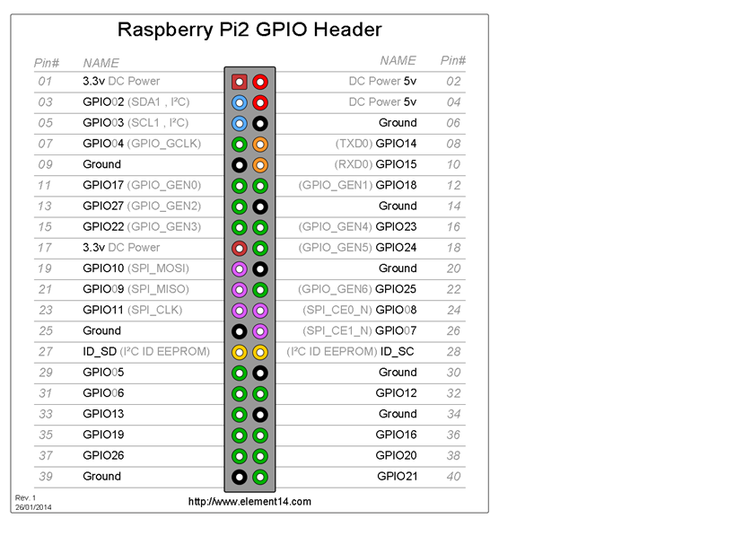
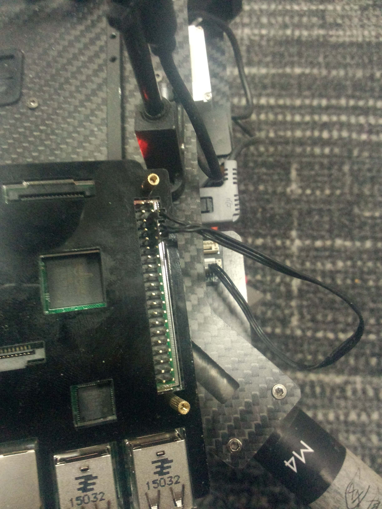

# DJI-Onboard-SDK-Raspberry-Transparent-Transmission

## Intro

This a simple demo for DJI Onboard SDK Transparent Transmission function. Also I run this demo on a Raspberry Pi.

I make this demo to detect PM 2.5 in air. And I believe everyone can obtain his/her own sensor data in the same way.

First, Pi gets sensor data from a PM 2.5 sensor. (I bought one from Taobao, which contains a USB-TTL moudel)

Second, Pi sends the data to M100 for Transparent Transmission.

Finially, the data shows on my phone or pad which is connected with M100's controllor.

>Fly your M100 with RPi instead of expensive NUC !   
>Also Fly your M100 with your own sensors too !

## Requirement

+ M100
+ Raspberry Pi
+ PM2.5 Sensor

## Setup

### 1. Connect Pi and M100  
As we know, RPi has a serial port with 3.3V. We can use it directly, so there is no need to purchase a USB-TTL model.  

Here is the definition of M100's serial port.   

   

   And this is the definition of RPI's serial port.

   

   

|M100|RPin| 
|----|----|  
|RXD  | Tx  (PIN 08)| 
|TXD  | Rx  (PIN 10)| 
|GND | GND (PIN 06)|

The connection looks like this.

   However, the serial port of RPi is designed for kernel, therefore we need to configure it.  
   >1. **edit cmdline.txt**  `sudo nano /boot/cmdline.txt`  
   change   
   `dwc_otg.lpm_enable=0 console=ttyAMA0,115200 kgdboc=ttyAMA0,115200 console=tty1 root=/dev/mmcblk0p2 rootfstype=ext4 elevator=deadline rootwait`    
   into  
   `dwc_otg.lpm_enable=0 console=tty1 root=/dev/mmcblk0p2 rootfstype=ext4 elevator=deadline rootwait`

   >2. **edit inittab** `sudo nano /etc/inittab`  
   Invaild the last line `#T0:23:respawn:/sbin/getty -L ttyAMA0 115200 vt100`

   In addition, to use this serial port within 230400 baudrate, we need to change uart clock.
   > **edit config.txt** `sudo nano /boot/config.txt`  
   > Add this in last `init_uart_clock=64000000`

   At last, restart your Pi and we can use `/dev/ttyAMA0` to communicate with M100.

### 2. Connect Pi and Sensor 
  My PM2.5 sensor is driven by a arduino, so this part is sample. I just install arduino for RPi, then I can find my sensor which is `/dev/ttyUSB0`

  In other cases, this part depends your specific sensors.

### 3. Code (DJI Onboard SDK Part)

I use `DJI_LIB` to develop the Onboard Part. All I need to do is call relative function to init Onboard SDK and send my data.

`PM25.cpp` is interface of my PM2.5 sensor, developers can use yourselves code instead.

>BTW: you can find `DJI_LIB` in Samples of DJI Onboard SDK. 

1\. Modify `Makefile` to add `DJI_LIB` in your progject. (You can refer to `Makefile` in this project)  

2\. Init Onboard SDK  

~~~c
if(Pro_Hw_Setup("/dev/ttyAMA0", 230400) < 0)      /* Open RPi <-> DJI Serial Port */
{
    perror( "UAV Serial Port Open ERROR" );
    return 0;
}
DJI_Pro_Setup(NULL);
~~~

3\. Init PM25  (Change it into your sensor interface)

~~~c
if(init_pm25("/dev/ttyUSB0", 2400) <0)            /* Open RPi <-> PM25 Serial Port */
{
    perror( "PM25 Serial Port Open ERROR" );
    return 0;
}
~~~  

4\. Activation  
  Just need to edit `key_buf`, `app_id` and `app_level`.  
  For Transparent-Transmission, either level 1 or level 2 is ok.  

~~~c
  /* activation */
activate_data_t user_act_data; 

char key_buf[65] = "Input your app_key ";   /* Input your app_key */
char app_bundle_id[32] = "1234567890";

user_act_data.app_id = Input your app_id;                     /* Input your app_id */
user_act_data.app_api_level = Input your app_level;                    /* Input your app_level */
user_act_data.app_ver = 0x02030A00; 
user_act_data.app_key = key_buf;  
strcpy((char*)user_act_data.app_bundle_id, app_bundle_id);

DJI_Pro_Activate_API(&user_act_data,NULL);
~~~

5\. Loop  

Get pm25 data and call sdk function to send it.  

~~~c
while(1)
{
    int nbyte;
    nbyte = read_pm25(buffer, 1024); 
    if (nbyte > 0) 
    {
        sdk_pure_transfer_hander((uint8_t*)buffer, nbyte);   /* Transparent-Transmit */
        printf("%s", buffer);
    } 
    sleep(1);
}
~~~

Transparent-Transmission handle

~~~c
int16_t sdk_pure_transfer_hander(uint8_t* pbuf, uint16_t len)    
{                                                                                         
    /* DJI_LIB */
    DJI_Pro_App_Send_Data(0 , 0, MY_ACTIVATION_SET, 0xFE, pbuf, len,NULL,0,1); 
    printf("[pure_transfer],send len %d data %s\n", len, pbuf);                                         
}
~~~

### 4. Code (DJI Mobile SDK Part)
  TODO
### 5. Compile & Run  
copy `pm25` folder into your Pi.
Then execute the following cmd. 
  `cd cmake`  
  `make`  
  `cd ../output`  
  `./pm25`  
The terminal should be like this.

~~~
Acttivation Successfully

0.0,25.0,59.8
[pure_transfer],send len 15 data 0.0,25.0,59.8

0.5,25.0,59.8
[pure_transfer],send len 15 data 0.05,25.0,59.8

0.9,25.0,59.8
[pure_transfer],send len 15 data 0.9,25.0,59.8
~~~

Run the App by Mobile device.
This is a sample App, but you can see the date has been received.